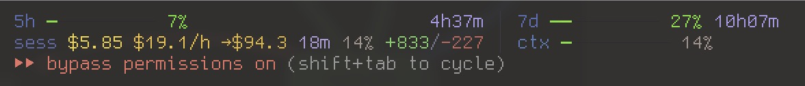

# ccwatch

**Fast cost & quota statusline for Claude Code.** Cached transcript scanning, configurable visibility, dedicated context bar.

[](https://www.npmjs.com/package/@terzigolu/ccwatch)
[](LICENSE)



## One-line install

```bash
npx @terzigolu/ccwatch
```

That's it. Open Claude Code — the statusline appears immediately. Then run `/ccwatch` inside Claude Code to choose which fields you want visible.

To remove:

```bash
npx @terzigolu/ccwatch uninstall
```

## Alternative: install as a Claude Code plugin

```
/plugin marketplace add https://github.com/terzigolu/ccwatch
/plugin install ccwatch
/setup
```

## What you get

- **5h / 7d quota bars** — green→yellow→red gradient with countdowns to reset.
- **Session cost & burn rate** — `$0.42  $1.40/h  →$3.10  18m` so you know where the session is heading.
- **Today / week / month / total** — running cost totals so you always know where the bill stands.
- **Per-project breakdown** — which project is eating your budget (cache hit rate included).
- **Dedicated context bar** (`ctxbar`) — separate progress bar for the context window, 0%→100%, color-graded.
- **Lines changed** — `+250/-40` so you can see whether output justifies the spend.

## Why ccwatch

You're burning through API credits or a $200/month Max subscription — but Claude Code doesn't tell you how fast, which project, or what it'll cost by end of day. ccwatch fills that gap.

It works with **both billing models**: API (pay-per-token) or a Pro/Max subscription (quota-based). No guessing, no surprises at the end of the month.

Two things that make ccwatch different:

1. **It's fast.** Other statuslines rescan the entire `~/.claude/projects` tree (often 900 MB+) on every render. ccwatch caches per-file by `mtime + size`, so cold-render is **~0.9s** and warm-render is **~80ms** — the bar feels instant even on big histories.
2. **You choose what's visible.** Run `/ccwatch` and a wizard walks you through which cells to show. Pick 4 or pick all 8.

## Configure visibility

Run `/ccwatch` inside Claude Code. The wizard asks which cells you want visible and writes the result to `~/.claude/plugins/ccwatch/config.json`.

Available cells:

| key | what it shows |
|-----|---------------|
| `5h` | 5h quota bar + countdown |
| `7d` | 7d quota bar + countdown |
| `today` | today's tokens + cost (global + per-project) |
| `history` | this week + this month cost |
| `session` | session cost, $/h, projection, duration, ctx%, lines |
| `total` | all-time cost + per-project total + cwd |
| `model` | ctx% + model name + clock |
| `ctxbar` | dedicated context-window progress bar |

Or edit `~/.claude/plugins/ccwatch/config.json` by hand:

```json
{
  "rows": [["5h", "7d"], ["session", "ctxbar"]],
  "compactRows": [["5h", "7d"], ["session"], ["ctxbar"]],
  "compactBreakpoint": 113,
  "columns": null
}
```

## Accurate to the cent

Most tools estimate costs with a flat rate. That's wrong — Opus output is **19x** more expensive than Haiku. ccwatch gets it right:

- **Per-model pricing** — reads the model ID from every message. Opus, Sonnet, Haiku each priced correctly.
- **Streaming dedup** — each API call writes 2–7 JSONL entries. ccwatch deduplicates by `message.id`. Every message counted exactly once.
- **Cache separation** — cache reads cost 10% of fresh input. ccwatch tracks them separately and shows ♻hit rate per project.
- **Cross-session history** — session cost resets when you restart. Your bill doesn't. ccwatch scans all JSONL — today, this week, this month, per project.

## How it works

```
stdin JSON → ccwatch CLI → cached scan of ~/.claude/projects/**/*.jsonl
           → dedup by message.id → per-model pricing
           → adaptive layout → stdout
```

- **API users** — exact costs from per-model token pricing.
- **Pro / Max subscribers** — reads OAuth quota via the Anthropic API. 5h and 7d bars show actual runway with countdowns.

## Slash commands

- `/ccwatch` — interactive visibility wizard (recommended)
- `/setup` — re-wire `statusLine.command` if it drifts
- `/configure` — edit config JSON directly (advanced)
- `/doctor` — diagnose plugin install + statusline wiring

## Uninstall

```bash
npx @terzigolu/ccwatch uninstall
```

Or via Claude Code:

```
/plugin remove ccwatch
```

## Authors

Built and maintained by:

- [yajinn](https://github.com/yajinn)
- [terzigolu](https://github.com/terzigolu)

## License

MIT — see [LICENSE](LICENSE).
